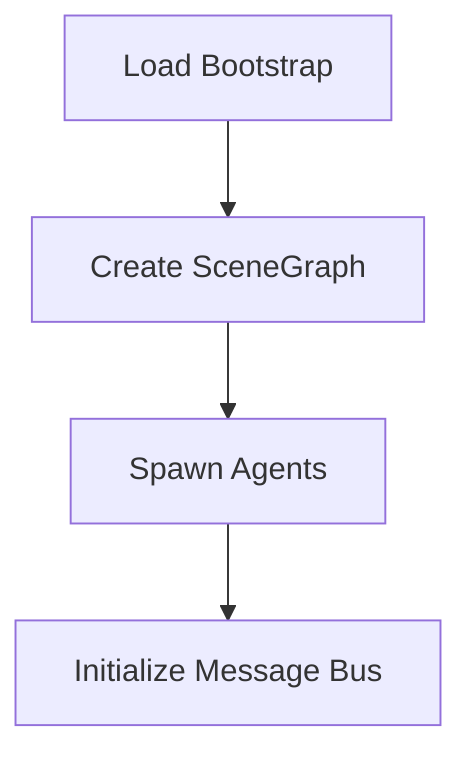
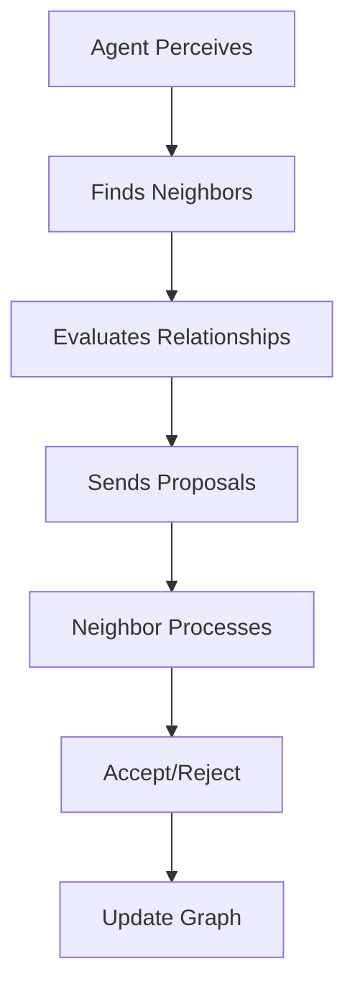
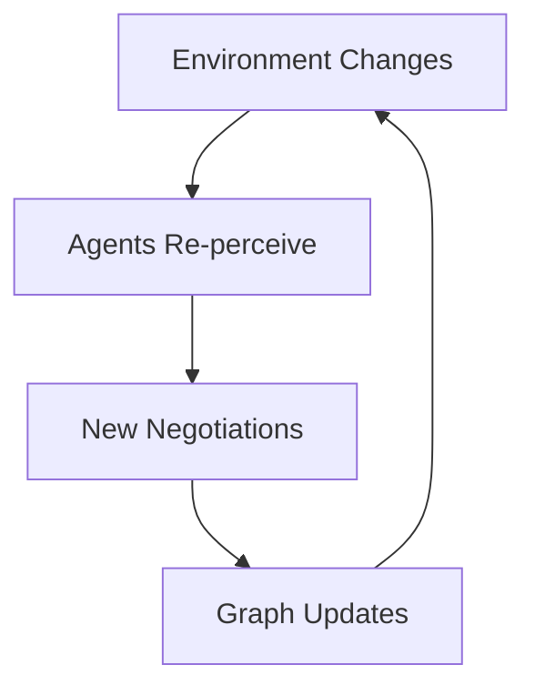

# SpacXT Architecture

## 🏗️ System Overview

SpacXT is built around four core components that work together to enable autonomous spatial reasoning:

```
┌─────────────────┐    ┌─────────────────┐    ┌─────────────────┐
│   SceneGraph    │◄───│   Orchestrator  │───►│     Agents      │
│  (Data Layer)   │    │ (Coordination)  │    │   (Intelligence)│
└─────────────────┘    └─────────────────┘    └─────────────────┘
         ▲                        │                       ▲
         │                        ▼                       │
         │               ┌─────────────────┐              │
         └───────────────│  A2A Protocol   │──────────────┘
                         │ (Communication) │
                         └─────────────────┘
```

## 📊 Core Components

### 1. **SceneGraph** - The Spatial Memory
The central data structure that maintains:

```python
class SceneGraph:
    nodes: Dict[str, Node]           # Objects in the scene
    relations: Dict[Tuple, Relation] # Spatial relationships
    events: List[Dict]               # Change history
```

**Key Features:**
- **Nodes**: Objects with position, orientation, properties
- **Relations**: Spatial relationships with confidence scores
- **Events**: Complete audit trail of all changes
- **Patches**: CRDT-style updates for distributed sync

### 2. **Agents** - The Spatial Intelligence
Each object becomes an autonomous agent with:

```python
class Agent:
    def perceive_and_propose(self):
        # 1. Scan environment for neighbors
        # 2. Evaluate spatial relationships
        # 3. Send proposals to nearby agents

    def handle_inbox(self):
        # 1. Process incoming proposals
        # 2. Accept/reject based on confidence
        # 3. Update scene graph with new relationships
```

**Agent Lifecycle:**
1. **Perception**: Scan environment within radius
2. **Evaluation**: Use spatial tools to assess relationships
3. **Proposal**: Send relationship suggestions to neighbors
4. **Negotiation**: Accept/reject incoming proposals
5. **Consensus**: Update shared spatial understanding

### 3. **Orchestrator** - The Coordination Layer
Manages the agent ecosystem:

```python
def tick(graph, bus, agents):
    # 1. Deliver messages between agents
    # 2. Let agents perceive and propose
    # 3. Process negotiations and update graph
```

**Responsibilities:**
- **Message Routing**: Deliver A2A communications
- **Tick Coordination**: Synchronize agent actions
- **Graph Updates**: Apply negotiated changes

### 4. **A2A Protocol** - The Communication Standard
Structured messages between agents:

```python
class A2AMessage:
    type: str           # "RELATION_PROPOSE" | "RELATION_ACK"
    sender: str         # Agent ID
    receiver: str       # Target agent ID
    payload: Dict       # Relationship data + metadata
```

## 🔄 Execution Flow

### Phase 1: Initialization


### Phase 2: Spatial Discovery


### Phase 3: Continuous Adaptation


## 🛠️ Technical Deep Dive

### Spatial Reasoning Engine
The `topo_tool.py` module provides spatial analysis:

```python
def relate_near(node_a, node_b, threshold=0.75):
    distance = calculate_3d_distance(node_a.pos, node_b.pos)

    if distance <= threshold:
        confidence = calculate_confidence(distance, threshold)
        return {"r": "near", "a": node_a.id, "b": node_b.id,
                "conf": confidence, "props": {"dist": distance}}
    else:
        return {"r": "far", ...}
```

### Confidence-Based Consensus
Relationships are not binary - they have confidence scores:

- **High Confidence (0.8-1.0)**: Very close objects, strong consensus
- **Medium Confidence (0.6-0.8)**: Moderate distance, likely relationship
- **Low Confidence (0.1-0.6)**: Borderline cases, may be rejected
- **Acceptance Threshold**: Agents accept proposals with confidence ≥ 0.6

### Event-Sourced Updates
All changes are tracked as immutable events:

```python
class GraphPatch:
    add_nodes: Dict[str, Node]
    update_nodes: Dict[str, Dict]
    add_relations: List[Relation]
    remove_relations: List[Tuple]
```

Benefits:
- **Auditability**: Complete change history
- **Undo/Redo**: Time travel through scene states
- **Distributed Sync**: Patches can be replayed across systems

## 🎯 Design Patterns

### 1. **Actor Model**
Each object is an independent actor that:
- Maintains its own state
- Communicates through messages
- Processes messages asynchronously

### 2. **CRDT-Inspired Updates**
Scene graph updates use conflict-free patterns:
- **Last-Write-Wins**: For property updates
- **Add-Wins**: For relationship additions
- **Timestamped**: All changes have timestamps

### 3. **Emergent Consensus**
No central authority - consensus emerges through:
- **Local decisions** by individual agents
- **Peer-to-peer negotiation**
- **Confidence-weighted voting**

## 🔧 Extensibility Points

### Custom Spatial Tools
Add new relationship types:
```python
def relate_inside(node_a, node_b):
    # Custom spatial logic
    return {"r": "inside", "conf": 0.9, ...}
```

### Advanced Agent Behaviors
Extend agent intelligence:
```python
class SmartAgent(Agent):
    def perceive_and_propose(self):
        # Add learning, memory, prediction
        super().perceive_and_propose()
        self.learn_from_history()
```

### Distributed Deployment
Scale across multiple systems:
- **Message Bus**: Replace in-memory with Redis/NATS
- **Scene Graph**: Distribute across multiple nodes
- **Agents**: Deploy on different machines

## 🚀 Performance Characteristics

### Scalability
- **O(n²) neighbor detection**: Each agent scans all others
- **O(k) message processing**: k = average neighbors per agent
- **Optimizable**: Spatial indexing, hierarchical agents

### Real-time Performance
- **Tick Rate**: 2 Hz in demo (configurable)
- **Message Latency**: Sub-millisecond in-memory
- **Graph Updates**: Incremental patches only

### Memory Usage
- **Nodes**: ~200 bytes per object
- **Relations**: ~100 bytes per relationship
- **Messages**: Transient, cleared each tick

---

*Next: Explore [Getting Started](getting-started.md) to build your first SpacXT application.*
